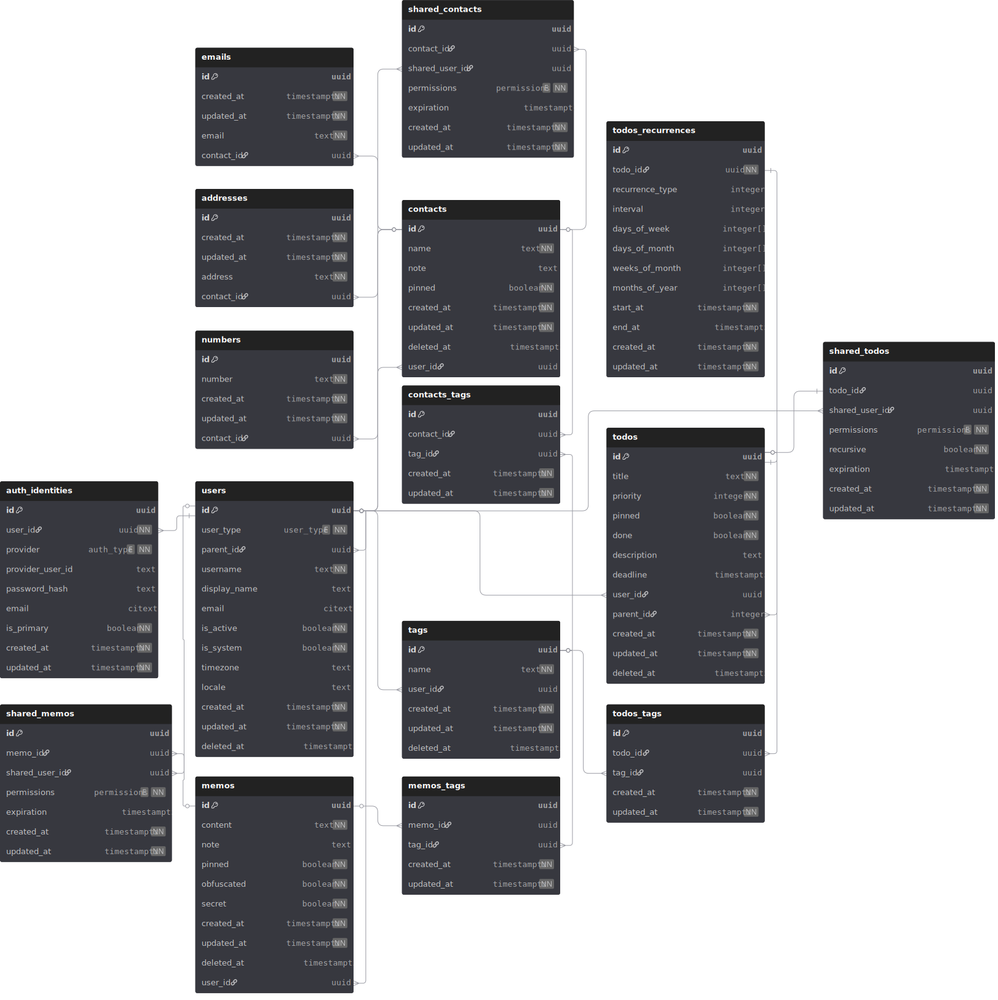

<!--
---
name: Yet Another Todo App (Sealy)
date: 2026-03-04
tags: [python, fastapi, alembic, sqlalchemy, pydantic, gql, reactnative]
summary: (WIP) Todo app with FastAPI + React Native
---
-->


# Yet Another Todo App


A backend-focused todo management system built to explore **reliable database design**, **migration safety**, and **Change Data Capture (CDC) pipelines**.

The project uses a mobile client (React Native) and a Python backend with PostgreSQL.  
The primary goal of this repository is to study **data consistency, migration safety, and event-driven CDC pipelines** built on top of a well-tested relational model.

## Overview
This project implements a backend architecture with a strong emphasis on:
- relational data modeling
- migration safety
- repository patterns
- transactional integrity
- database-driven testing

Future milestones will introduce:
- API backend
- Change Data Capture pipeline
- Client integration

in that order of implementation.

## Tech Stack
Backend
- Python
- SQLAlchemy
- PostgreSQL
- Alembic
- Pytest

Infrastructure (so far)
- Docker
- GitHub Actions

Client
- React Native (planned)

CDC Pipeline
- PostgreSQL WAL and logical decoding/replication (planned)
- CDC connector (TBD: most likely Debezium)
- Event Streaming Platform (TBD: most likely Kafka)

## DB Design



Key design considerations:

- query-driven schema design
- indexed access paths for frequent queries
- limited denormalization for performance
- transaction safety and predictable migrations

## Architecture (Planned)
```plaintext
Client | React Native App

Backend | API Layer ➡️ Repository Layer ➡️ SQLAlchemy ORM ➡️ PostgreSQL

Data Pipeline | CDC (Logical Replication) ➡️ Event Stream / Consumers
```

## Project structure (So far)
```
.
├── alembic/
├── alembic.ini
├── Dockerfile
├── pyproject.toml
├── sealy/
│   ├── api/
│   ├── core/
│   ├── db/
│   ├── schemas/
│   ├── static/
│   └── main.py
└── tests/
```

## Development Setup
- Python 3.12
- PostgreSQL 16
- Docker 29.2.1
- Clone the repository, 
- Create a virtual environment (`python -m venv .venv` or similar)
- Install dependencies: `pip install -e .`
- Export dev db environ before alembic/pytest commands on local tests e.g., `PG_TEST_URL=... pytest`

<br>

## Roadmap

### Milestone 1 - Database layer (in progress)
This milestone focuses on building a **reliable database layer**.
- [x] Schema design
- [x] ORM models
- [x] Migration system
- [ ] Repository queries
- [ ] Transaction handling
- [ ] DB test suite

Test coverage includes:

| Area | Purpose |
|-----|------|
| ORM model validation | Ensure schema constraints match application models |
| Migration tests | Validate forward-only migrations |
| Repository tests | Verify query correctness |
| Transaction tests | Guarantee rollback / commit behavior |
| DB setup tests | Ensure environment safety and isolation |

### Milestone 2 - API Layer
- authentication
- request validation
- error handling
- API versioning

### Milestone 3 - CDC Pipeline
- replication
- event stream processing
- downstream consumers

### Milestone 4 - Client

## Engineering Notes

<details>
<summary>Notes</summary>

- Index the search target table not the source
- most frequented queries? -> optimize specifically for that. Analyze traffic
- done with pre-join, materialized views, small denormalization
- use connection pool. don't open a new db connection **per request!**
- one request should be 1 to 3 queries not ten something queries (worst case db latency 10ms -> must be < 200ms according to SLO)
- no looped queries! let the query do the job
- API tests should treat DB as a black box: e.g., `@pytest.mark.integration`, `@pytest.mark.api`
- **Always proof-read and edit alembic script manually after revision! e.g., add extension, create enum explictly, etc...**
- **Non-negotiables**
  - **Clear README (setup, usage, architecture)**
  - **Environ, secrets**
  - **Structured logging**
  - **Error handling**
  - **Dockerize**
  - **More tests**
  - **Config separation (dev/prod)**
  - **CI pipeline (GitHub Actions)**
  - **Database migrations**
  - **Health checks**
  - **Monitoring hooks**
  - **Realistic data volumes**
  - **API versioning**
- We don't want anything slipping through the cracks!
  - Through meticulousness, you gain clarity,
  - Through clarity, you gain productivity,
  - Through productivity, you gain ...bullet points,
  - Through bullet points, you get a job!

</details>

<details>
<summary>Todos</summary>

- Drop unnecessary ids
- JWT + argon2 pw hashing
- token refresh
- Errors
- Firebase messaging -> push
- Indexes
- Make notes for future revision, clean up revision, re-init on prod

</details>
